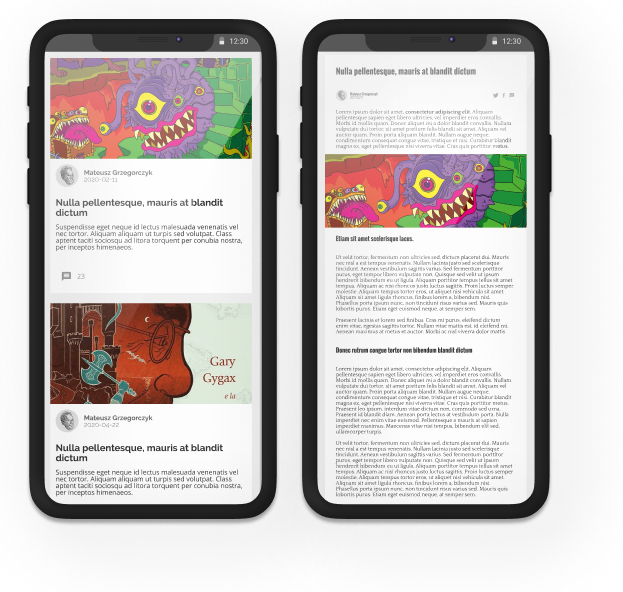

# Cms-blog
### A blog website with a cms for managing content

## General Info

This rails application works together with this [javascript client](https://github.com/michalgrzegor/cms-blog).  
  
Blog posts management system is built from scratch. The editor is implemented using Quill as a WYSIWYG editor, 
and Delta as a format for communication (https://quilljs.com/). Image upload and storage is implemented using 
ActiveStorage, and Amazon S3 service.  
  
Authentication is implemented using Devise.  
  
The OAuth 2.0 Authorization Framework is implemented using Doorkeeper (Authorization Code Grant is used to sign in
a user to the application). Refresh tokens are used to refresh access tokens.  
  
Link to blog: [blog website](https://musing-ramanujan-8002a4.netlify.app)  
Link to admin panel: [login](https://musing-ramanujan-8002a4.netlify.app/auth)  
  
Credentials for test account:  
- email: admin@admin.com
- password: adminadmin

## Technologies

- ruby 2.7.1
- rails 6.0.3
- javascript
- postgresql
- devise
- doorkeeper
- active_storage
- amazon S3 service
- textacular
